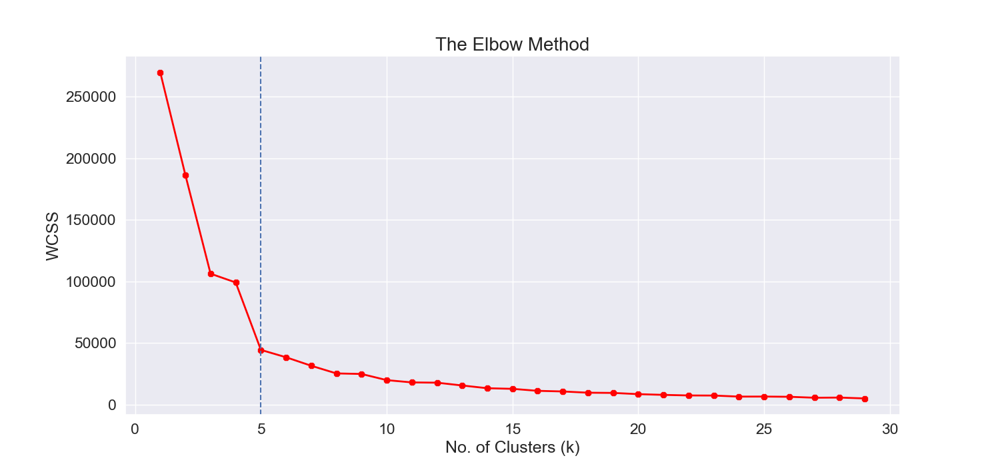
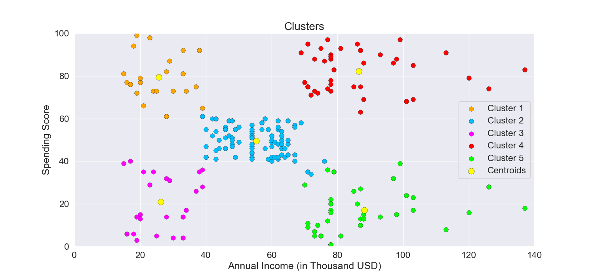

# 🧠 Customer Segmentation Using K-Means

Welcome! This project demonstrates how K-Means Clustering, an unsupervised machine learning algorithm, can be used to segment customers based on behavioral data. These insights can help businesses develop targeted marketing strategies, improve customer experience, and drive sales.

---

## 📌 Problem Statement

Businesses often struggle to understand the unique behaviors and preferences of their customers. Without proper segmentation, marketing campaigns may underperform, and customer engagement can drop.

**Goal**: Use customer data (age, income, and spending score) to group customers into distinct segments using K-Means clustering.

---

## 🧰 Tools & Technologies Used

- **Programming Language**: Python
- **Libraries**: 
  - `pandas` – data manipulation
  - `numpy` – numerical operations
  - `matplotlib` & `seaborn` – data visualization
  - `scikit-learn` – machine learning (KMeans)
- **Jupyter Notebook** – for analysis and visualization

---

## 📁 Dataset Description

The dataset used contains the following features for each customer:

- `CustomerID`: Unique identifier
- `Gender`: Male/Female
- `Age`: Age of the customer
- `Annual Income (k$)`: Customer’s income in thousands
- `Spending Score (1–100)`: Score assigned based on spending behavior

---

## 📈 Methodology

1. **Data Cleaning & Preprocessing**
   - Checked for null values
   - Filtered and selected relevant columns (`Age`, `Annual Income`, `Spending Score`)
   - Scaled the data to improve clustering accuracy

2. **Exploratory Data Analysis (EDA)**
   - Visualized relationships between features using scatter plots and histograms
   - Observed distributions of income and spending scores

3. **Finding Optimal Clusters (Elbow Method)**
   - Applied K-Means with varying values of `k`
   - Used the Elbow Curve to determine the optimal number of clusters

4. **Clustering**
   - Trained the K-Means model with optimal `k`
   - Assigned cluster labels to each customer

5. **Visualization of Clusters**
   - 2D scatter plots with distinct colors for each segment
   - Interpreted characteristics of each cluster

---

## 📊 Results & Key Insights

The model segmented customers into **5 clusters**, each showing distinct behaviors:

- **Cluster 1**: High income, low spending – likely price-conscious
- **Cluster 2**: Low income, high spending – impulsive buyers
- **Cluster 3**: Young and high spending – trendy target group
- **Cluster 4**: Moderate income and spending – average behavior
- **Cluster 5**: Older with moderate spending – loyal customers

These insights can help businesses:

- Personalize promotions and offers
- Improve customer engagement
- Design better loyalty programs

---

## 📸 Visualizations

### 🔹 Elbow Method


Shows the optimal number of clusters (k = 5) based on the distortion score.

### 🔹 Customer Segmentation


Colored scatter plot showing customer groups based on income and spending score.

---

## ✅ Conclusion

This project showcases how unsupervised machine learning can be effectively applied to real-world marketing problems. Using just three customer features, the business can gain actionable insights to enhance customer targeting and increase retention.

---

## 📎 How to Use

1. Clone the repository  
```bash
git clone https://github.com/Anshu6608/Customer-Segmentation-Using-K-Means.git
